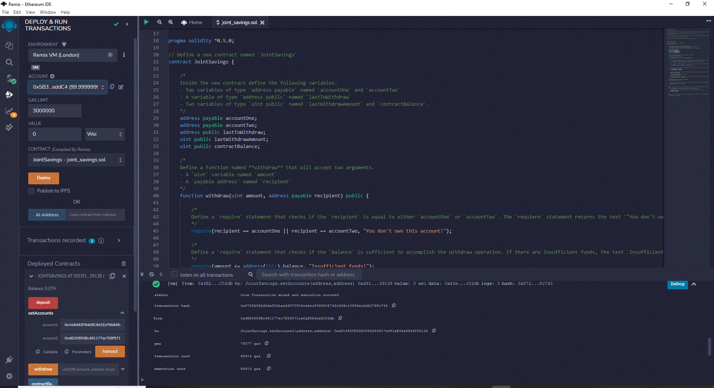
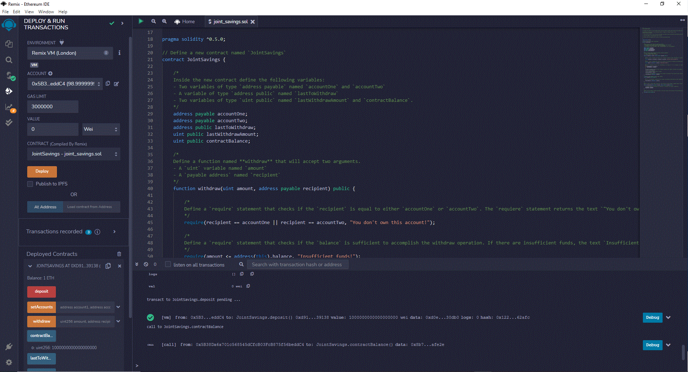
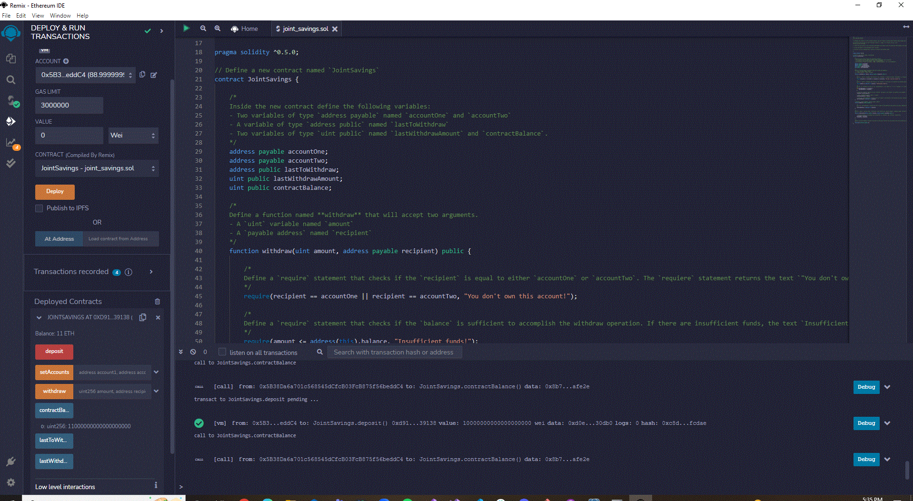
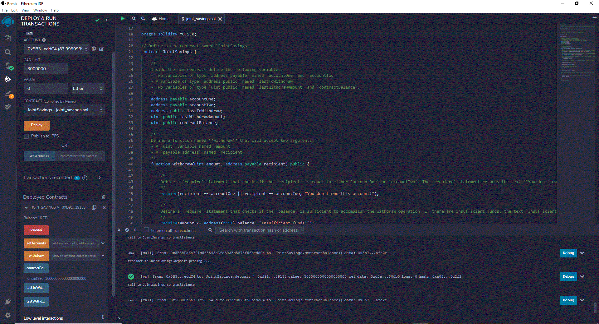
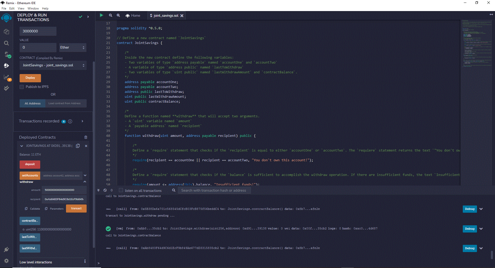
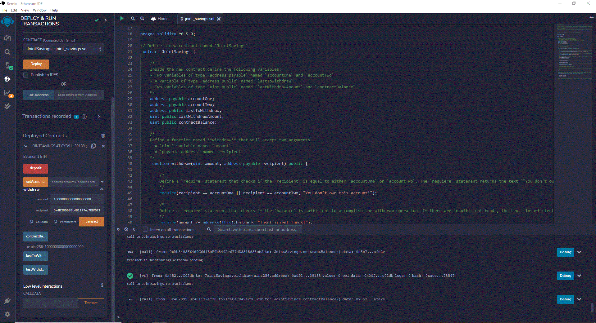
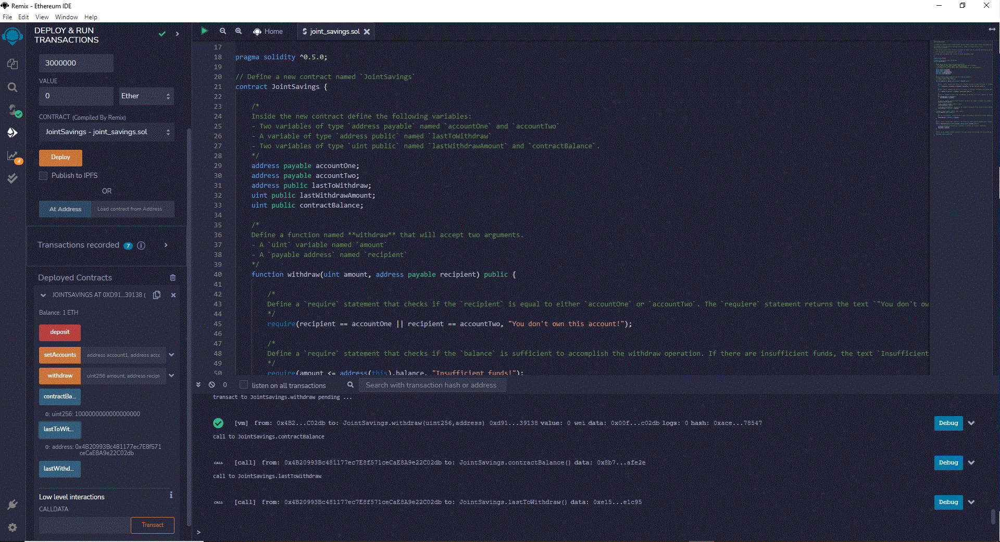
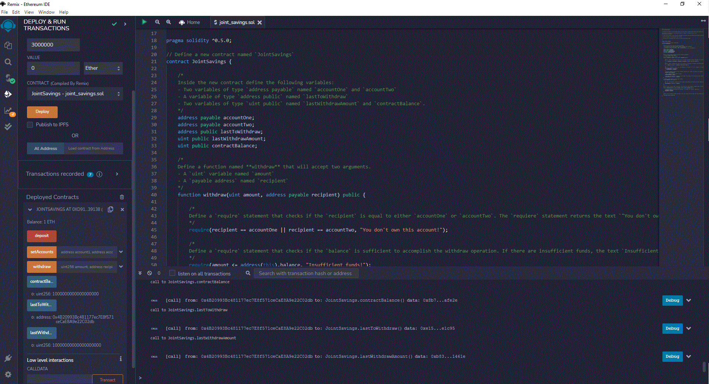

# Joint Savings Smart Contract
This application implements a joint savings smart contract on the Ethereum blockchain by accepting two user addresses.  The smart contract uses ether management functions with the ability to deposit and withdraw funds from these accounts.

---

## Technologies

This application leverages solidity version 0.5.0 with the following libraries and packages:

* [remix](https://remix.ethereum.org) - An open source web and desktop application used for the entire journey of contract development with Solidity language as well as a playground for learning and teaching Ethereum.

* [solidity](https://docs.soliditylang.org/en/v0.8.17/) - Solidity is an object-oriented, high-level language for implementing smart contracts. Smart contracts are programs which govern the behaviour of accounts within the Ethereum state.

---

## Usage

To use the joint savings smart contract you must first launch Remix by opening up a browser:

```Remix
https://remix.ethereum.org
```

Then compile and deploy the following smart contract solidity code onto the Ethereum blockchain:

```Solidity
joint_savings.sol
```

###Initiate setAccounts function for 2 addresses:



###Send 1 ETH as Wei to joint savings smart contract:



###Send 10 ETH as wei to joint savings smart contract:



###Send 5 ETH to joint savings smart contract:



###Withdraw 5 ETH from joint savings into account one:



###Withdraw 10 ETH from joint savings into account two:



###Show last to withdraw account address:



###Show last to withdraw amount:


---

## Contributors

Brought to you by [Drew Herrera](https://www.linkedin.com/in/andrewjherrera).

---

## License

Licensed under the MIT License. Copyright 2022 Drew Herrera.
